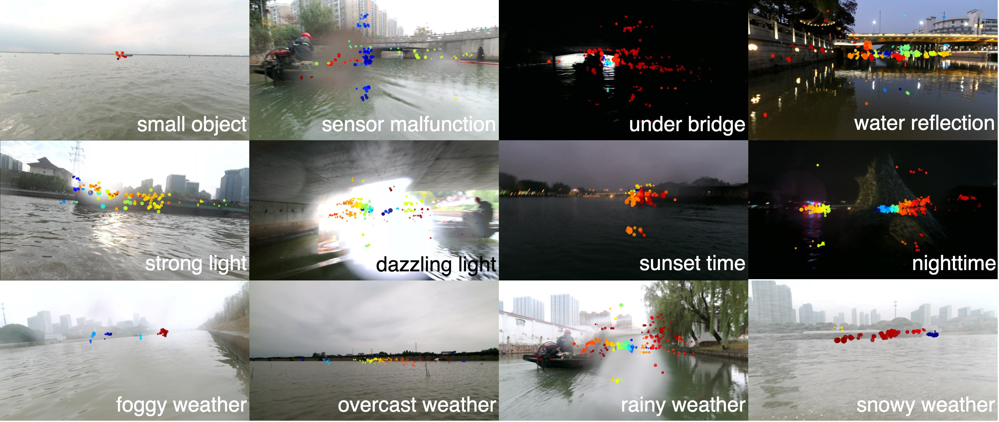

# Awesome Water Surface Perception

 

## Overview
- [Teams](#teams)
- [Workshops](#workshops)
- [Surveys](#surveys)
- [Datasets](#datasets)
- [Tasks](#tasks)
  - [Detection](#detection)
    - [Small Object Detection](#small-object-detection)
  - [Segmentation](#segmentation)
  - [Tracking](#tracking)
  - [Diffusion](#diffusion)
  - [Image Enhancement](#image-enhancement)

## Teams
* ### WaterScenes [[Website](https://waterscenes.github.io)] [[Github](https://github.com/WaterScenes)] 
  University of Liverpool, Xi'an Jiaotong-Liverpool University, Institute of Deep Perception Technology, Jiangsu Industrial Technology  Research Institute
  
* ### Marine Intelligent Perception and Computation (MIPC) Group [[Website](http://mipc.whut.edu.cn/publications.html)] 
  Wuhan University of Technology
  
* ### Avalon [[Website](https://uni-tuebingen.de/fakultaeten/mathematisch-naturwissenschaftliche-fakultaet/fachbereiche/informatik/lehrstuehle/kognitive-systeme/projects/avalon/)] 
  University of Tübingen

* ### Visual Cognitive Systems (ViCos) Laboratory [[Website](https://vicos.si/research/autonomous-boats)] [[Datasets](https://box.vicos.si/borja/viamaro/index.html)] 
  University of Ljubljana 

## Workshops

* ### MaCVi 2024
  * The 2nd Workshop on Maritime Computer Vision (MaCVi) 2024 [[Website](https://macvi.org/workshop/macvi24)] [[Results](https://arxiv.org/abs/2311.14762)] [[Paper List](https://openaccess.thecvf.com/WACV2024_workshops/MaCVi)]
  * Baseline: **SeaDronesSee**: A Maritime Benchmark for Detecting Humans in Open Water [*`SeaDroneSee`*] [[Paper](https://arxiv.org/abs/2105.01922)]
  * 2023 - **Sea You Later**: Metadata-Guided Long-Term Re-Identification for UAV-Based Multi-Object Tracking [*`SeaDroneSee-MOT`* *`BoaTrack`*] __`WACV Workshop`__ [[Paper](https://arxiv.org/abs/2311.03561)] (🥇 in UAV-based Multi-Object Tracking, and 🥇 in USV-based Multi-Object Tracking)
  * 2023 - **ReIDTracker Sea**: the technical report of BoaTrack and SeaDronesSee-MOT challenge at MaCVi [*`SeaDroneSee-MOT`* *`BoaTrack`*] __`WACV Workshop`__ [[Paper](https://arxiv.org/abs/2311.07616)] (🥈 in UAV-based Multi-Object Tracking, 🥉 in USV-based Multi-Object Tracking)
  * 2023 - [**DLR-BoaTrack**]: Improving YOLOv8 with Scattering Transform and Attention for Maritime Awareness [*`SeaDroneSee-MOT`* *`BoaTrack`*] __`ISPA`__ [[Paper](https://ieeexplore.ieee.org/document/10279352)] (+BoT-SORT, 🥉 in UAV-based Multi-Object Tracking)
  * 2023 - **SeaDSC**: A video-based unsupervised method for dynamic scene change detection in unmanned surface vehicles [*`RoboWhaler`*] __`WACV Workshop`__ [[Paper](https://arxiv.org/abs/2311.11580)]

* ### MaCVi 2023
  * The 1nd Workshop on Maritime Computer Vision (MaCVi) 2023 [[Website](https://macvi.org/workshop/macvi23)] [[Results](https://ieeexplore.ieee.org/document/10031200/)] [[Paper List](https://openaccess.thecvf.com/WACV2023_workshops/MaCVi)]
  * Baseline: **SeaDronesSee**: A Maritime Benchmark for Detecting Humans in Open Water [*`SeaDroneSee`*] [[Paper](https://arxiv.org/abs/2105.01922)]
  * 2023 - A Novel Framework to Evaluate and Train Object Detection Models for Real-Time Victims Search and Rescue at Sea with Autonomous Unmanned Aerial Systems Using High-Fidelity Dynamic Marine Simulation Environment [*`SeaDroneSee`*] [[Paper](https://ieeexplore.ieee.org/document/10031171)]
  * 2023 - Improving the Detection of Small Oriented Objects in Aerial Images [[Paper](https://openaccess.thecvf.com/content/WACV2023W/MaCVi/papers/Zhao_YOLOv7-Sea_Object_Detection_of_Maritime_UAV_Images_Based_on_Improved_WACVW_2023_paper.pdf)]
  * 2023 - **YOLOv7-Sea**: Object Detection of Maritime UAV Images Based on Improved YOLOv7 [[Paper](https://openaccess.thecvf.com/content/WACV2023W/MaCVi/papers/Doloriel_Improving_the_Detection_of_Small_Oriented_Objects_in_Aerial_Images_WACVW_2023_paper.pdf)]
  

## Surveys
* 2017 - Video Processing From Electro-Optical Sensors for Object Detection and Tracking in a Maritime Environment: A Survey __`TITS`__ [[Paper](https://ieeexplore.ieee.org/document/7812788)]
* 2023 - Deep learning-based object detection in maritime unmanned aerial vehicle imagery: Review and experimental comparisons __`EAAI`__ [[Paper](https://www.sciencedirect.com/science/article/pii/S0952197623016974)]

## Datasets

| **Name** | **Year** | **Task** | **Affiliation** | **Link** |
| --- | --- | --- | --- | --- |
| **MarDCT** | 2015 | Classification   Object Detection   Tracking | Sapienza University of Rome| [Website](http://www.diag.uniroma1.it//~labrococo/MAR/index.htm)   [Paper](http://www.diag.uniroma1.it//~bloisi/papers/bloisi-vrs2015-draft.pdf) |
| **MODD** | 2016 | Object Detection   Semantic Segmentation | University of Ljubljana| [Website](http://vision.fe.uni-lj.si/RESEARCH/modd/)   [Paper](https://arxiv.org/abs/1503.01918)   [Github](https://vicos.si/resources/modd/) |
| **SMD** | 2017 | Object Detection   Object Tracking | The Arctic University of Norway| [Website](https://sites.google.com/site/dilipprasad/home/singapore-maritime-dataset)   [Paper](https://openaccess.thecvf.com/content_CVPRW_2019/papers/PBVS/Moosbauer_A_Benchmark_for_Deep_Learning_Based_Object_Detection_in_Maritime_CVPRW_2019_paper.pdf)   [Github](https://github.com/yaoshanliang/Singapore-Maritime-Dataset) |
| **Visual-Inertial-Canoe**  | 2018 | SLAM |  University of Illinois at Urbana-Champaign| [Website](https://databank.illinois.edu/datasets/IDB-9342111)   [Paper](https://journals.sagepub.com/doi/pdf/10.1177/0278364917751842)|
| **MODD2** | 2018 | Object Detection   Semantic Segmentation  |University of Ljubljana| [Website](https://box.vicos.si/borja/viamaro/index.html)   [Paper](https://arxiv.org/abs/1802.07956)   [Github](https://arxiv.org/abs/1802.07956) |
| **MaSTr1325** | 2019 | Semantic Segmentation | University of Ljubljana| [Website](https://vicos.si/resources/mastr1325/)   [Paper](https://ieeexplore.ieee.org/document/8967909)   [Github](https://github.com/bborja/modd) |
| **Tampere-WaterSeg** | 2019 | Semantic Segmentation | Tampere University| [Paper](https://ieeexplore.ieee.org/document/8918694) |
| **MID** | 2020 | Object Detection | Shanghai University| [Paper](https://doi.org/10.1002/rob.21983)   [Github](https://github.com/aluckyi/MID) |
| **WSODD** | 2021 | Object Detection   Instance Segmentation | Beijing Institute of Technology | [Paper](https://www.frontiersin.org/articles/10.3389/fnbot.2021.723336/full)  [Github](https://github.com/sunjiaen/WSODD) |
| **USVInland** | 2021 | SLAM   Stereo Matching   Water Segmentation | ORCA-tech | [Weibsite](https://www.orca-tech.cn/datasets/USVInland/Introduction)   [Paper](https://arxiv.org/abs/2103.05383)   [Github](https://github.com/ORCA-Uboat/USVInland-Dataset) |
| **FloW** | 2021 | Object Detection   Multimodal Object Detection | ORCA-tech | [Website](https://www.orca-tech.cn/datasets/FloW/Introduction)   [Paper](https://openaccess.thecvf.com/content/ICCV2021/html/Cheng_FloW_A_Dataset_and_Benchmark_for_Floating_Waste_Detection_in_ICCV_2021_paper.html)   [Github](https://github.com/ORCA-Uboat/FloW-Dataset) |
| **SeaDronesSee** | 2021 | Object Detection   Object Tracking | University of Tuebingen | [Website](https://seadronessee.cs.uni-tuebingen.de)   [GitHub](https://github.com/Ben93kie/SeaDronesSee)   [Paper](https://openaccess.thecvf.com/content/WACV2022/html/Varga_SeaDronesSee_A_Maritime_Benchmark_for_Detecting_Humans_in_Open_Water_WACV_2022_paper.html) |
| **WaterScenes** | 2023 | Object Detection   Instance Segmentation   Semantic Segmentation   Free-Space Segmentation   Waterline Segmentation   Panoptic Perception | University of Liverpool | [Website](https://waterscenes.github.io)   [GitHub](https://github.com/WaterScenes/WaterScenes)   [Paper](https://arxiv.org/abs/2307.06505) |
| **LaRS** | 2023 | Semantic Segmentation   Panoptic Segmentation | University of Ljubljana | [Website](https://lojzezust.github.io/lars-dataset)   [GitHub](https://github.com/lojzezust/lars_evaluator)   [Paper](https://arxiv.org/abs/2308.09618) |
| **MVDD13** | 2024 | Object Detection | Dalian Maritime University | [GitHub](https://github.com/yyuanwang1010/MVDD13)   [Paper](https://www.sciencedirect.com/science/article/pii/S0141118723003760) |

## Tasks

### Detection

* 2019 - Object Detection in a Maritime Environment: Performance Evaluation of Background Subtraction Methods [*`SMD`*] __`TITS`__  [[Paper](https://ieeexplore.ieee.org/abstract/document/8401855)]
* 2020 - Are Object Detection Assessment Criteria Ready for Maritime Computer Vision? [*`SMD`*] __`TITS`__  [[Paper](https://ieeexplore.ieee.org/document/8911242)]
* 2023 - **Achelous**: A Fast Unified Water-surface Panoptic Perception Framework based on Fusion of Monocular Camera and 4D mmWave Radar  [*`WaterScenes`*] __`ITSC`__ [[Paper](https://arxiv.org/abs/2307.07102)] [[GitHub](https://github.com/GuanRunwei/Achelous)]
* 2023 - An Automated Method for the Creation of Oriented Bounding Boxes in Remote Sensing Ship Detection Datasets __`WACV Workshop`__ [[Paper](https://openaccess.thecvf.com/content/WACV2024W/MaCVi/html/Savathrakis_An_Automated_Method_for_the_Creation_of_Oriented_Bounding_Boxes_WACVW_2024_paper.html)]

#### Small Object Detection
* 2023 - A novel Multi to Single Module for small object detection  [*`SeaDroneSee`*] [[Paper](https://arxiv.org/abs/2303.14977)]
* 2024 - [**RCFNet**] Small Object Detection on the Water Surface Based on Radar and Camera Fusion [*`FloW`*] __`ICASSP`__ [[Paper](https://ieeexplore.ieee.org/abstract/document/10446880)]

### Segmentation
* 2018 - Stereo obstacle detection for unmanned surface vehicles by IMU-assisted semantic segmentation [*`MODD2`*] [[Paper](https://www.sciencedirect.com/science/article/pii/S0921889017305808)]
* 2021 - ShorelineNet: An Efficient Deep Learning Approach for Shoreline Semantic Segmentation for Unmanned Surface Vehicles [*`MODD2`*]  **IROS** [[Paper](https://ieeexplore.ieee.org/document/9636614)]

### Tracking
* 2021 - A Robust Deep Affinity Network for Multiple Ship Tracking  [*`SMD`*] __`TIM`__ [[Paper](https://ieeexplore.ieee.org/abstract/document/9423987)]
* 2023 - Asynchronous Trajectory Matching-Based Multimodal Maritime Data Fusion for Vessel Traffic Surveillance in Inland Waterways __`TITS`__ [[Paper](https://ieeexplore.ieee.org/abstract/document/10159572)]
* 2023 - Stable Yaw Estimation of Boats from the Viewpoint of UAVs and USVs __`ECMR`__ [[Paper](https://arxiv.org/abs/2306.14056)]
* 2023 - Memory Maps for Video Object Detection and Tracking on UAVs __`IROS`__ [[Paper](https://arxiv.org/abs/2303.03508)]
* 2024 - Active Vision-Based Finite-Time Trajectory-Tracking Control of an Unmanned Surface Vehicle Without Direct Position Measurements __`TITS`__ [[Paper](https://ieeexplore.ieee.org/abstract/document/10443713)]

### Diffusion
* 2023 - **SafeSea**: Synthetic Data Generation for Adverse & Low Probability Maritime Conditions [*`SeaDroneSee`*] __`WACV Workshop`__[[Paper](https://arxiv.org/abs/2311.14764)] [[Code](https://github.com/martin-3240/SafeSea)]

### Image Enhancement
* 2023 - AiOENet: All-in-One Low-Visibility Enhancement to Improve Visual Perception for Intelligent Marine Vehicles Under Severe Weather Conditions  __`TIV`__[[Paper](https://ieeexplore.ieee.org/abstract/document/10375786)] [[Code](https://github.com/LouisYuxuLu/AiOENet)]
